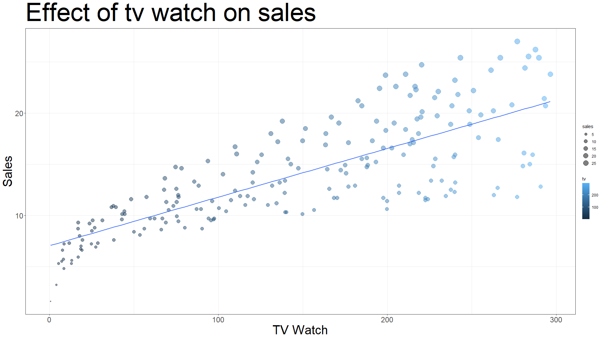
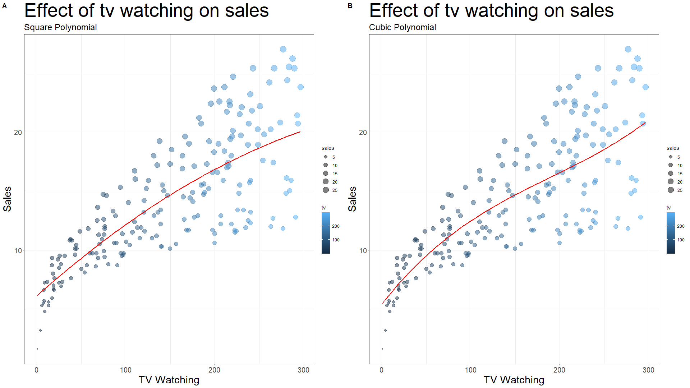
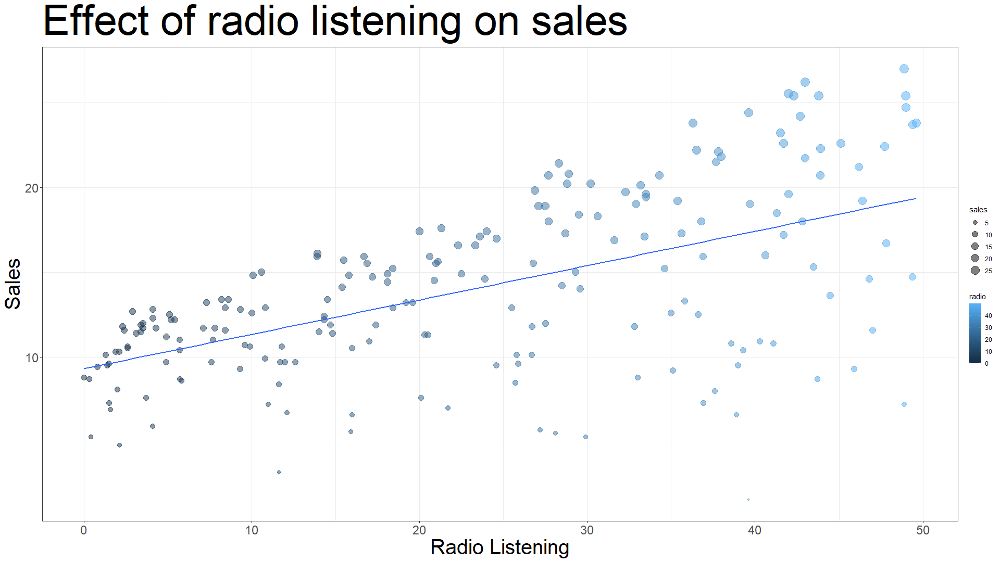
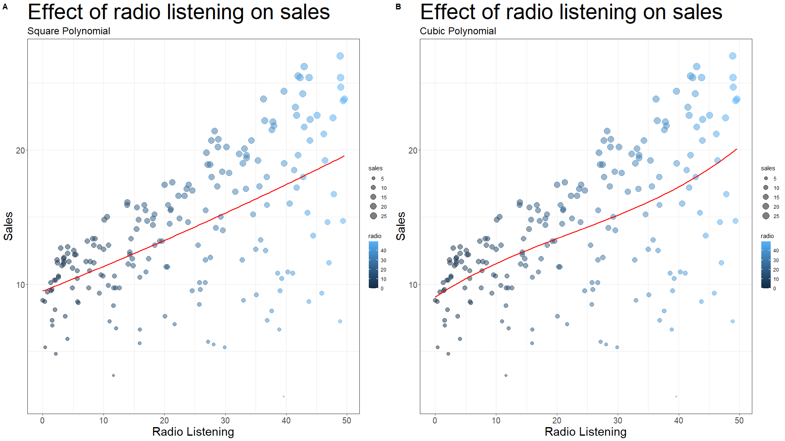
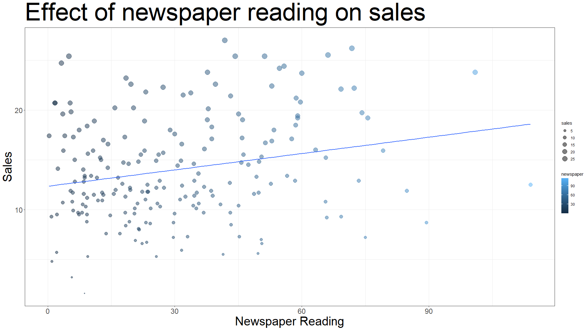
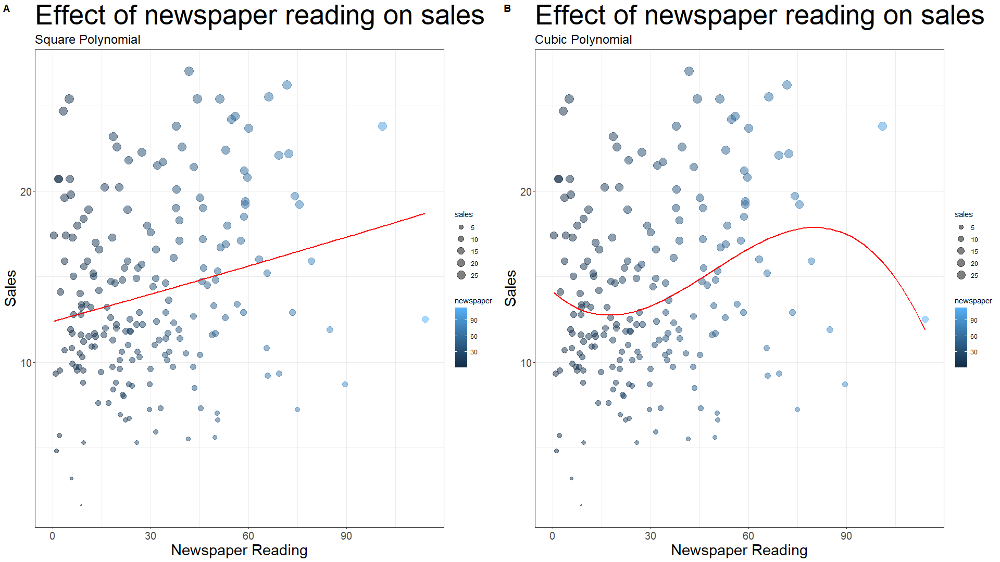
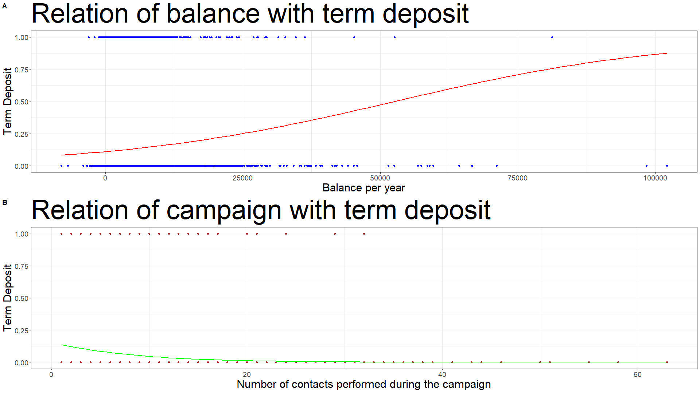

# Sales Regression


Predicting and analyzing sales trends using regression techniques on sales data. This project applies machine learning models to uncover patterns and improve business forecasting.

## Tech Stack


## Download

```bash
  git clone https://github.com/adionmission/Sales-Regression.git
```

## About

Linear regression and logistic regression have been applied on dataset where one represents sales data and other represents if the consumer has subscribed to term deposit.

The sales data consists of n number of integers which are not categorical. So linear regression is applied to find the effect of independent variable over dependent variable.

In another dataset the dependent variable is in categorical form, so applied logistic regression in it.

R lauguage is used as we just need to define a function in a pipline. Therefore, tasks become more earier.

## Data Pipeline in R

```r
  data_clean = df %>%
    drop_na() %>%
    janitor::clean_names()
```

## About Dataset

 - The first dataset is the advertising dataset which consists of sales through tv, radio and newspaper.

 - The second dataset is related with direct marketing campaigns of a Portuguese banking institution. The marketing campaigns were based on phone calls. Often, more than one contact to the same client was required, in order to access if the product (bank term deposit) would be ('yes') or ('no') subscribed.

## Data Cleaning

In first dataset, 
 - x parameter has been removed as it will not be used.

```r
  data_clean = df %>%
    subset(select = -c(x))
```

In second dataset, 
 - columns are renamed for better understanding. 

```r
  colnames(data_clean) = c("age",
                        "job",
                        "marital",
                        "education",
                        "credit_default",
                        "balance",
                        "house_loan",
                        "personal_loan",
                        "contact",
                        "days",
                        "month",
                        "duration",
                        "campaign",
                        "pdays",
                        "previous",
                        "poutcome",
                        "term_deposit")
```
 - Dependent variable has been renamed from yes-no to 1-0. 

```r
  data_clean$term_deposit[data_clean$term_deposit == "yes"] = 1
  data_clean$term_deposit[data_clean$term_deposit == "no"] = 0
```

 - Data types are converted to numeric.

```r
  data_clean$term_deposit = as.numeric(data_clean$term_deposit)
```

## Linear Regression

Linear regression analysis is used to predict the value of a variable based on the value of another variable. The variable you want to predict is called the dependent variable. The variable you are using to predict the other variable's value is called the independent variable.

On first dataset, linear regression is applied where sales was the dependent variable and all other parameters are dependent variable. As it is a linear model, so independent variable is used one at a time.

#### Case 1

TV is used as a independent variable and sales is used a dependent variable.



For polynomail regression



The above result shows that as the tv watch increases, sales increases.

| Model             | Error        | Multi R-Square | Adj R-Square |   P-value    |
| ----------------- | -------------| -------------|-------------| -------------|
| Linear | 3.259 | 0.6119 | 0.6099 | < 2.2e-16 |
| Square | 3.237 | 0.619 | 0.6152 | < 2.2e-16 |
| Cubic | 3.232 | 0.622 | 0.6162 | < 2.2e-16 |

As p-value is very close to 0, therefore, highly significant that result doesn't happened by luck.

#### Case 2

Radio is used as a independent variable and sales is used a dependent variable.



For polynomial regression



The above result shows that as the radio listening increases, sales increases.

| Model             | Error        | Multi R-Square | Adj R-Square |   P-value    |
| ----------------- | -------------| -------------|-------------| -------------|
| Linear | 4.275 | 0.332 | 0.3287 | < 2.2e-16 |
| Square | 4.285 | 0.3323 | 0.3256 | < 2.2e-16 |
| Cubic | 4.291 | 0.3338 | 0.3236 | < 2.2e-16 |

As p-value is very close to 0, therefore, means highly significant that result doesn't happened by luck.

#### Case 3

Newspaper is used as a independent variable and sales is used a dependent variable.



For polynomial regression



The above result shows that as the newspaper reading increases, sales increases.

| Model             | Error        | Multi R-Square | Adj R-Square |   P-value    |
| ----------------- | -------------| -------------|-------------| -------------|
| Linear | 5.092 | 0.05212 | 0.04733 | 0.001148 |
| Square | 5.105 | 0.05213 | 0.04251 | 0.005126 |
| Cubic | 5.045 | 0.07926 | 0.06517 | 0.001019 |

As p-value is very close to 0, therefore, means highly significant that result doesn't happened by luck but still more than the previous two cases.

## Optimization

The nth power for polynomial can go to infinity but that value should be selected which make the R-square more close to 1.

## Logistic Regression

Logistic regression is a process of modeling the probability of a discrete outcome given an input variable. The most common logistic regression models a binary outcome; something that can take two values such as true/false, yes/no, and so on.

To perform logistic regression task, second dataset has been used. Multiple csv files were given form which bank-full.csv has been used.

For now, two variable that are balance and campaign were used as an independent variable and term_deposit as independent variable.



Accuracy = 0.881931 or 88.19%

The S-shaped curve in the relation of balance with term deposit shows that if balance per year of a customer is higher, then there are more changes that they will subscribe to term deposit. The slope in the second graph shows the opposite.

## Acknowledgements

 - [Dataset1](https://www.kaggle.com/datasets/purbar/advertising-data)
 - [Dataset2](https://archive.ics.uci.edu/ml/datasets/bank+marketing)
